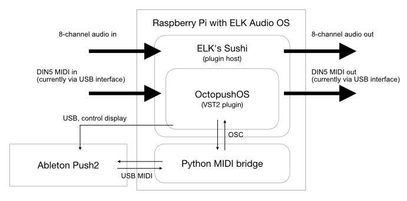

<p align="center">

</p>

Table of Contents
=================

* [1. What is Octopush?](#1-what-is-octopush)
* [2. How does Octopush work?](#2-how-does-octopush-work)
* [3. Current status/limitations](#3-current-statuslimitations)
* [4. Building Octopush for "desktop" computers (macOS and linux)](#4-building-octopush-for-desktop-computers-macos-and-linux)
   * [4.1 Repository checkout](#41-repository-checkout)
   * [4.2 Building Projucer](#42-building-projucer)
   * [4.3 Development build](#43-development-build)
   * [4.4 Release build](#44-release-build)
* [5. Building Octopush for the ELK platform](#5-building-octopush-for-the-elk-platform)
   * [5.1 Cross-compilation from macOS](#51-cross-compilation-from-macos)
      * [5.1.1 Prepare ELK development SDK](#511-prepare-elk-development-sdk)
      * [5.1.2 Repository checkout](#512-repository-checkout)
      * [5.1.2 Preparing some code dependencies](#512-preparing-some-code-dependencies)
      * [5.1.3 Building OctopushOS](#513-building-octopushos)
   * [5.2 Deploying and runnning OctopushOS in the ELK board](#52-deploying-and-runnning-octopushos-in-the-elk-board)
      * [5.2.1 Deploying OctopushOS in the ELK board](#521-deploying-octopushos-in-the-elk-board)
      * [5.2.2 Running OctopushOS in the ELK board](#522-running-octopushos-in-the-elk-board)
* [6. Licenses](#6-licenses)


## 1. What is Octopush?

Octopush is a work in progrees project to make an **open source stand alone music sequencer and sampler** based on the low-latency real-time **ELK AudioOS** for **Rapsberry Pi**, and using **Abelton's Push2** as a hardware interface. Basically, I want to build by own hardware sampler+sequencer using a Raspberry Pi, a Push2, and reusing existing nice software.

Octopush is a long term project that I'll probably never finish. Hopefully I'll reach to an interesting point someday, and I'll certainly have fun in the way. Or maybe I'll find people who wants to help and we'll make something nice together.

The name "Octopush" comes from the inspiration for this project, which was [this Youtube video](https://www.youtube.com/watch?v=K4VwDtPFDdI) of a jam with an **Octatrack**. Then I thought "I need something like this", but I saw lots of MIDI limitations in it, and then I said "I need to make my own". I have a **Push2**, so I thought that I'd write some software to connect to it and make the instrument. I guess by now the origin of the name is evident, *Octatrack + Push ~= Octopush*. Also by that time I just finished reading [this amazing book about octopuses](https://en.wikipedia.org/wiki/Other_Minds:_The_Octopus,_the_Sea,_and_the_Deep_Origins_of_Consciousness), so it all kind of made sense. 

The current status of the project is that I'm working on a sort of technical solution/proof of concept that connects all the pieces of software and hardware that I want to use. I have made some software that does basic loop playing and step sequencing, and connects to Push2 to use it as the UI nicely. This works fine running on my desktop macOS computer. It also runs fine on the Raspberry Pi. I'm in the process of porting this to the ELK platform to be able to get low-latency multi-channel audio IO when running in the Pi. I almost have it working, but there are still some issues here and there that need fixes. More details below...


## 2. How does Octopush work?

OcotpushOS is implemented as a JUCE audio plug-in and can be edited and built using standard JUCE workflows. It uses the [Trakction Engine](https://github.com/Tracktion/tracktion_engine) to do all the hard audio processing tasks. The plugin runs on the [ELK Audio Os](https://elk.audio) platform (with a Raspberry Pi and the ELK development board, with 8 audio inputs and 8 audio outptus). Ableton Push2 is connected to the Raspberry Pi via USB, and Octopush connects to it to use it as the hardware interface.

Below is a system block diagram of Octopush:

<p align="center">

</p>

The Python MIDI bridge is necessary because under the ELK platform it is not possible for a plugin to access multiple MIDI devices with separate MIDI connections, therefore there needs to be an intermediary app which talks to Push2 to set button and colors (and others), and receive actions like when a pad is pressed. This intermediary app talks to the OctopushOS plugin via OSC. If running OctopushOS in a desktop computer (with a plugin host different than ELK's Sushi and without running on a RT kernel thread), then the intermediary app is not needed because the plugin can talk directly to Push2 (this is indeed what happens when building Octopush for development in a desktop computer.


## 3. Current status/limitations

 * The current technology demo features a basic Push2 interface and a system with 7 audio tracks which play a number of loops simultaneously and has a step sequencer that can be edited in real time. It only routes 2 audio inputs to 2 other outputs. This works well when running in desktop computers (tested in macOS) and also works well when running in a Rapsberry Pi without ELK AudioOS (hence without low-latency multichannel audio I/O).
 
 * The current technology demo works more or less fine in the ELK platform, but there are a number of issues related to the use of Tracktion Engine in a real-time system like ELK Audio OS (locks, CPU mode switches...) that still need to be fixed. At the current state, everything except the step sequencer seems to be working, and also a few mode switches are still happening which might be reducing performance. Also there are issues printing text in the Push2 display. My few development efforts are currently oriented to fixing these issues...


## 4. Building Octopush for "desktop" computers (macOS and linux)


**NOTE**: these steps have been recently tested on macOS and should work well. For linux I have not tested them for a while but I also think it should be working fine.


### 4.1 Repository checkout

You need to checkout the code including submodules. This will download source code for all required 3rd party libraries (JUCE, etc.)

```
git clone https://github.com/ffont/octopush.git && cd octopush && git submodule update --init
```

### 4.2 Building Projucer

For development, you'll want to build Projucer so you can edit `OctopushOS.jucer` file. Even though you can use pre-built Projucer downloaded from JUCE website, here we provide a script to build a GPL-enabled version of Projucer. `cd` into the cloned repository and run the following:

```
cd scripts
./build_release_projucer_gpl
```

This builds the audio plugin in several formats as well as astandalone executable. which will be placed in `OctopushOS/3rdParty/juce/extras/Projucer/Builds/MacOSX/build/Release/Projucer` (MacOSX) or `OctopushOS/3rdParty/juce/extras/Projucer/Builds/LinuxMakefile/build/Release/Projucer` (Linux) depending on the platform you're running it from. Plugin version will be palced next to the executables.

If building from Linux, the following dependencies need to be installed:
```
# JUCE dependencies
apt-get install clang git ladspa-sdk freeglut3-dev g++ libasound2-dev libcurl4-openssl-dev libfreetype6-dev libjack-jackd2-dev libx11-dev libxcomposite-dev libxcursor-dev libxinerama-dev libxrandr-dev mesa-common-dev webkit2gtk-4.0 juce-tools

# push2-display-with-juce dependencies
apt-get install libusb-1.0-0-dev
```
This list of dependencies was taken from [this forum thread](https://forum.juce.com/t/list-of-juce-dependencies-under-linux/15121/31). It could be the case that some of these are actually not needed, I have not tested them individually.


**NOTE**: OctopushOS is configured to be built in different plugin formats including legacy VST2. To do that you'll need to place the legacy VST2 framework files. VST2 builds require to have the VST2 sdk properly installed in a folder specified i the projucer file. I enable VST2 target because I need to build Octopush as a plugin for linux when running in Raspberry Pi, and the version I use of JUCE does not support VST3 plugin builds for linux. If you don't want to build VST2, just untick the VST2 option from the jucer file using Projucer.


### 4.3 Development build

To build OctopushOS during development you can use project files for Xcode (MacOSX) or the Makefile (Linux). You'll find these in the `OctopushOS/Builds/` folder. Alternatively you can use the provided utility script. `cd` into the cloned repository and run the following:

```
cd scripts
./build_debug_octopushOS
```

The generated executable (for the santadalone version) will be placed in `OctopushOS/Builds/MacOSX/build/Debug/OctopushOS` (MacOSX) or `OctopushOS/Builds/LinuxMakefile/build/Debug/OctopushOS` (Linux) depending on the platform you're running it from. Plugin version will be palced next to the executables.


### 4.4 Release build

A utility script is provided to build OctopushOS in release mode. `cd` into the cloned repository and run the following:

```
cd scripts
./build_release_octopushOS
```

The generated executable (for the santadalone version) will be placed in `OctopushOS/Builds/MacOSX/build/Release/OctopushOS` (MacOSX) or `OctopushOS/Builds/LinuxMakefile/build/Release/OctopushOS ` (Linux) depending on the platform you're running it from. Plugin version will be palced next to the executables.


## 5. Building Octopush for the ELK platform


### 5.1 Cross-compilation from macOS

To build OctopushOS for ELK Audio OS you need to cross-compile it from your development computer. I use macOS so these instructions apply to my setup. For Linux it should probably be simpler and you should refer to the ELK docs.

To do the cross compilation (and also deployment to the board) I prepared a Python script using [Fabric 2](http://www.fabfile.org) so I assume you have a Python 3 interpreter installed in your system with the Fabric 2 package installed (`pip install fabric` should do it).

#### 5.1.1 Prepare ELK development SDK

First thing to do is to prepare the ELK development SDK docker image following the [instrucitons here](https://github.com/elk-audio/elkpi-sdk/blob/master/running_docker_container_on_macos.md). You need to run steps 1 to 3, no need to run the toolchain when everything installed.


#### 5.1.2 Repository checkout

You need to checkout the code including submodules. This will download source code for all required 3rd party libraries (JUCE, etc.)

```
git clone https://github.com/ffont/octopush.git && cd octopush && git submodule update --init
```

#### 5.1.2 Preparing some code dependencies

OctopushOS needs to be built as a VST2 plugin, meaning that you need the VST2 SDK installed in your computer. The Python script used to build OctopushOS will try to mount the VST2 SDK in the Docker container so it can be used for compilation. The script will search for a folder names `VST_SDK` (the SDK) at the same directory level where the `octopush` folder is (if needed, you can edit this in `fabfile.py`).

OctopushOS also needs a custom version of JUCE which is patched to remove some graphical dependencies (as required by the ELK platform), and to patch some JUCE functions so these work in a RT kernel and don't trigger mode switches. The [patched version of JUCE I use is here](https://github.com/ffont/JUCE) (it is an adaptation of the existing JUCE fork by ELK). You need to clone that repository and place it inside a folder named `ELK` at the same level of `octopush` and `VST_SDK` folders. It should look like `ELK/JUCE`.

#### 5.1.3 Building OctopushOS

With all this in place, you should be able to cross-compile OctopushOS for ELK by simply doing:

```
cd octopush/scripts
fab compile
```

This will take a while, specially the first time it runs. When it finished, it should have generated an `OctopushOS.so` file in `OctopushOS/Builds/ELKAudioOS/build/OctopushOS.so` which is the VST2 plugin that you can run in ELK platform.


### 5.2 Deploying and runnning OctopushOS in the ELK board


#### 5.2.1 Deploying OctopushOS in the ELK board

Once the plugin is built, you can deploy the plugin to the ELK board by running:

```
fab send
```

This will copy the built plugin together with the files for the Python MIDI bridge and a start script.

**NOTE**: You can do both `compile` and `send` steps together by running `fab deploy` instead.


#### 5.2.2 Running OctopushOS in the ELK board

After plugin is built and coppied, you simply need to login to the Raspberry Pi as `elk` user and run `start.sh` (script will be in home folder). This will spawn the Python MIDI bridge and `sushi` plugin host with a configuration for OctopushOS. 

**NOTE1:** Before doing that you'll need to install the Python dependencies for the Python MIDI bridge in the board. Just run `pip install requirements.txt` in the Raspberry Pi (as user `elk`, in the home folder).

**NOTE2:** For the Push2 display to work properly, you need to give special permissions to the `elk` user (this is a `libusb` thing). You can easily do this by copying the file `octopush/sandbox/50-push2.rules` to `/etc/udev/rules.d/50-push2.rules` in the Raspberry Pi board, and then running (also in the board):

```
sudo udevadm control --reload-rules
sudo udevadm trigger
```


## 6. Licenses

Octopush is released under the **GPLv3** open source software license (see [LICENSE](https://github.com/ffont/octopush/blob/master/LICENSE) file) with the code being available at  [https://github.com/ffont/octopush](https://github.com/ffont/octopush). Octopush uses the following open source software libraries: 

* [juce](https://juce.com), available under GPLv3 license ([@26c9468](https://github.com/WeAreROLI/JUCE/tree/26c9468dc53ee76b836125e397ec4b7fa6417452), v5.4.5)
* [tracktion_engine](https://github.com/Tracktion/tracktion_engine), available under GPLv3 license ([@381e322](https://github.com/Tracktion/tracktion_engine/tree/381e3220571419d726be759f305576bba2df46cc))
* [libusb](https://github.com/libusb/libusb), availavle under LGPLv2.1 ([@1734873](https://github.com/libusb/libusb/tree/17348731b48702cece1bc783b3764975e495840d))
* [push2-display-with-juce](https://github.com/Ableton/push2-display-with-juce), available under MIT  ([@3107788](https://github.com/Ableton/push2-display-with-juce/tree/310778820f0182254652af405002b9e5bcd2d548))
